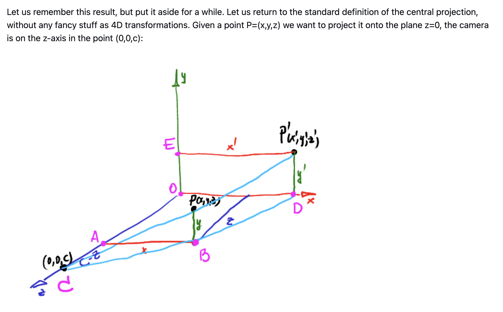
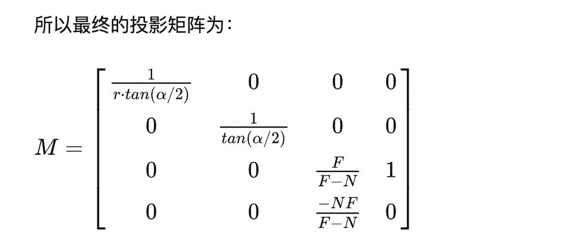

# TinyRenderer 项目学习笔记：
## Lesson 1
1. 使用重心坐标公式得不出需要的结果：没有注意int与float直接的互换。输入的三角形点坐标是int，但是重心坐标是float。

## Lesson 2

## Lesson 3 Z-Buffer & Texture Mapping
### 课程总结：
1. 为三角形的光栅化增加深度测试，做出阴影，具体步骤，在triangle函数中：
   1. 创建zBuffer缓存，用于存储物体的z值，z值越大，表示物体离camera的距离越近。
   2. 如果在当前pixel的坐标，点P的坐标，他的z值大于zBuffer中已有的值，说明他离camera更近，我们为这个物体在这个pixel里shading，并更新zBuffer的值
2. 使用纹理映射为模型贴图，具体步骤：
   1. 从模型文件obj中加载纹理坐标(u,v)并存入vector2i uv_中
   2. 调用model中的函数load_texture，把texture加载到一个TGAImage中作为贴图
   3. 根据obj中的索引(f的信息)，得到当前face的当前vertex的纹理坐标的索引值(faces[nface][nvertex][1])，然后根据索引找到纹理坐标，完成了纹理映射
   4. 使用坐标(u,v)取得纹理贴图中该点的颜色数据，并作为color给三角形上色
3. model文件中新增了：
   1. 变量：
      1. std::vector<Vec2f> uv_; 
      2. TGAImage diffusemap_; 
   2. 函数：
      1. void load_texture(std::string filename, const char *suffix, TGAImage &img)
      2. Vec2i uv(int iface, int nvert);
      3. TGAColor diffuse(Vec2i uv);
      4. std::vector<int> face(int idx);
   
### 问题总结
1. 深度测试，Z-buffer中的值该怎么求？
   - P.z的值就是三角形三个顶点ABC的z值的加权平均，即P.z = A.z * Alpha + B.z * Beta + C.z * Gamma
2. 深度测试在哪里做？
   - 在三角形的光栅化时做，即函数triangle里
3. 如何动态地创建二维数组：
```
    float **zbuffer = new float*[Width];    //创建一个指向指针数组的指针 **zbuffer
    for(int i = 0; i < Width; i++){
        zbuffer[i] = new float[Height]; //指针数组中的每个指针指向一个数组
        for(int j = 0; j < Height; j++){
            zbuffer[i][j] = -std::numeric_limits<float>::max();
        }
    }
```
4. obj文件的信息：
   - v:顶点坐标，每个顶点有（x,y,z）三个值
   - vt：纹理坐标，每个坐标有(u,v)两个值
   - vn：顶点的法线向量(x,y,z)三个值
   - f：表示一个面，每行由三个tuple组成，每个tuple是： (v的索引/vt的索引/vn的索引)
5. 如何插值：
   - zBuffer: 当我们知道三角形（object）三个顶点的z坐标（距离camera的距离）后，就能通过插值的方式知道点P对应的z坐标（距离camera的距离）：
     - 通过obj file得到三角形三个顶点坐标pts[0], pts[1], pts[2]
     - 通过P点的重心坐标(alpha, beta, gamma)，我们得到P点对应的z坐标：
       - P.z = pts[0].z * alpha + pts[1].z * beta + pts[2].z * gamma
   - 纹理映射：当我们知道三角形三个顶点对应的纹理坐标后，就能通过插值的方式知道点P对应的纹理坐标：
     - 通过obj file得到三角形顶点的纹理坐标uv[0], uv[1], uv[2]
     - 通过P点的重心坐标(alpha, beta, gamma)，我们得到P点对应的纹理坐标uvP:
       - uvP.u = uv[0].u * alpha + uv[1].u * beta + uv[2].u * gamma
       - uvP.v = uv[0].v * alpha + uv[1].v * beta + uv[2].v * gamma
```
for(int k = 0; k < 3; k++){
  P.z += pts[k].z * baryCentricCoord[k];   //P.z的插值就是三角形三个顶点ABC的z值的加权平均，即A.z * Alpha(顶点A) + B.z * Beta（顶点B） + C.z * Gamma(顶点C)
  uvP.x += uv[k].x * baryCentricCoord[k]; //同理，插值后P的纹理坐标uvP.x的值就是三角形三个顶点对应的纹理坐标的值的加权平均，
  uvP.y += uv[k].y * baryCentricCoord[k]; // 插值后P的纹理坐标y同理
}
```
6. 如何读取obj文件？
   - 参考model.cpp里的文件读取函数的注释

## Lesson 4 Perspective Projection
### 课程要点：
1. We know that diagonal coefficients of the matrix scale our world along the coordinate axes
2. Homogeneous coordinates方便了人们用单个矩阵同时表示物体的scaling，rotating，还有translating
3. In homogeneous coordinates all things with z=0 are vectors, all the rest are points。在齐次坐标系里，z = 0的是向量，其他的是点。
4. 方法一：求Perspective Projection的matrix（**与大部分的定义不同，摄像机的位置在(0,0,c)**）：
   1. 先看一个矩阵乘法，用齐次坐标系，我们用矩阵 M 把任意一个点 K: $(x, y, z)$变换到点 K': $(\frac{x}{rz+1}, \frac{y}{rz+1},\frac{z}{rz+1}) $: 
   \
   $\begin{bmatrix}
      1 & 0 & 0 & 0\\
      0 & 1 & 0 & 0\\
      0 & 0 & 1 & 0\\
      0 & 0 & r & 1\\
   \end{bmatrix} * 
   \begin{bmatrix}
      x\\
      y\\
      z\\
      1\\
   \end{bmatrix} = 
   \begin{bmatrix}
      x\\
      y\\
      z\\
      rz + 1\\
   \end{bmatrix}$
   \
   经过变换后：得到结果点K'
   \
   $\begin{bmatrix}
      x\\
      y\\
      z\\
      rz + 1\\
   \end{bmatrix} = 
   \begin{bmatrix}
      \frac{x}{rz+1}\\
      \frac{y}{rz+1}\\
      \frac{z}{rz+1}
   \end{bmatrix}$  
   <br/>
   2. 然后看下图中的三角形：
    
      1. $\bigtriangleup ABC$与$\bigtriangleup ODC$是相似三角形:
         - $(\frac{|AB|}{|AC|} = \frac{|OD|}{|OC|}) \Rightarrow (\frac{x}{c-z} = \frac{x'}{c}) \Rightarrow (x' = \frac{x}{1- \frac{z}{c}})$
      2. 同理可得：$ y' = \frac{y}{1 - \frac{z}{c}}$
      3. 最终结果得到一个点P'为 $
         \begin{bmatrix}
         \frac{x}{1- \frac{z}{c}}\\
         \frac{y}{1 - \frac{z}{c}}\\
         \frac{z}{1 - \frac{z}{c}} = 0
      \end{bmatrix}$。
      当$r = -\frac{1}{c}$时，K' = $ \begin{bmatrix}
         \frac{x}{1- \frac{z}{c}}\\
         \frac{y}{1 - \frac{z}{c}}\\
         \frac{z}{1 - \frac{z}{c}} 
      \end{bmatrix}$。由此得出，当我们把 $r = -\frac{1}{c}$ 带入矩阵M，可以得到Perspective Projection 矩阵：$\begin{bmatrix}
      1 & 0 & 0 & 0\\
      0 & 1 & 0 & 0\\
      0 & 0 & 1 & 0\\
      0 & 0 & -\frac{1}{c} & 1\\
   \end{bmatrix}$。该矩阵可以把任意点(x,y,z)投射到平面z = 0上。我们只需要用x', y'就可以得到物品在平面上的位置，z'可以用了完成z-buffer。
   4. 此种方法由于camera在(0,0,c)上，因此在求ModelView矩阵时，我们要使用的矩阵是：$\begin{bmatrix}
      x[0] & x[1] & x[2] & 0\\
      y[0] & y[1] & y[2] & 0\\
      z[0] & z[1] & z[2] & 0\\
      -target[0] & -target[1] & -target[2] & 1\\
   \end{bmatrix}$
5. 方法二：求Perspective Projection的matrix。（**大部分的定义方式，摄像机的位置在原点(0,0,0)**）：
   1. 使用以下投影矩阵：
   
   [求投影矩阵函数来源戳这里<----------](https://stackoverflow.com/questions/18404890/how-to-build-perspective-projection-matrix-no-api)
   2. 根据[Learn WebGL](http://learnwebgl.brown37.net/08_projections/projections_perspective.html)可知：
      1. aspect是Width/Height。
      2. fovy一般取区间[30,60]度，fovy在放入tan()函数中计算时要变成rad，假设degree = 30度：fovy_rad = 30.f * M_PI/180.f。
      3. fovy越大，物品看起来越远，fovy越小，物品看起来越大
      4. 经典的near和far取值范围是[0.1, 100]。
      5. 示例中，aspect = 1， fovy = 45度， near = 10， far = 20
   3.  此种方法由于camera在(0,0,0)上，因此在求ModelView矩阵时，我们要使用的矩阵是**M的逆矩阵**：$M = \begin{bmatrix}
      x[0] & y[0] & z[0] & eye[0]\\
      x[1] & y[1] & z[1] & eye[1]\\
      x[2] & y[2] & z[2] & eye[2]\\
      0 & 0 & 0 & 1\\
   \end{bmatrix}$,我们返回$M.inverse()$
      